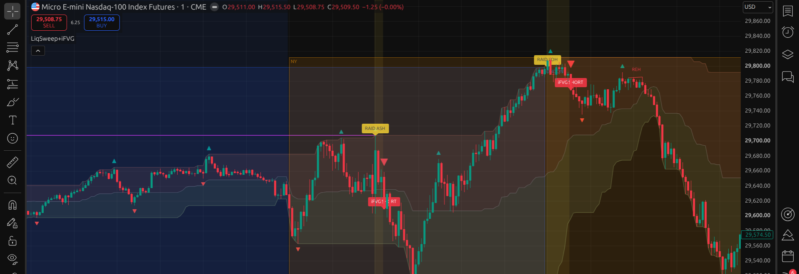
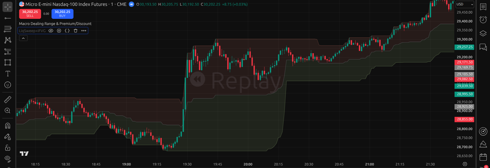

# TradingView Indicators

Pine Script v6 indicators for intraday futures. Built and tested on MNQ (Micro E-mini Nasdaq-100), 1-minute timeframe.

## LiqSweep+iFVG

Session-liquidity raid into inverted-FVG reversal (the DodgysDD-style liquidity-sweep / iFVG model).

- Tracks each session's high and low (New York, London, Asia) as liquidity levels; a level dies on its first touch, and a new session's level replaces the previous one of the same type.
- A raid beyond a tracked level (by a configurable buffer) arms a reversal in the opposite direction for a limited window.
- Entry signal: a Fair Value Gap gets body-closed through its far edge against the raid direction (iFVG inversion). One inversion clears every live arm of that direction: one signal per reversal. A gap formed before the sweep can invert; only the inversion has to happen after the raid.
- Optional modules: equal highs/lows tracking (EQH/EQL, CantoLab "EQ & RE" structure) with optional raid-arming, a higher-timeframe FVG overlay (5m / 15m / 1h / 4h / daily), session boxes, raid labels, the Macro Dealing Range premium/discount zones (the standalone indicator below, built in as a group 06 toggle, on by default), and Williams-fractal swing-point marks (group 07, default 10 periods).
- Signal timing validated on 60 days of real MNQ 1-minute data: the entry triangle prints on the inversion bar (enter next bar).

**File:** [`LiqSweep_iFVG.pine`](LiqSweep_iFVG.pine). Paste into TradingView's Pine editor. Works on any timeframe; defaults were tuned and validated on MNQ 1-minute. Signals print on the inversion bar (enter next bar).

## Macro Dealing Range & Premium/Discount

Shades the active dealing range's premium (upper) and discount (lower) halves directly on the chart, so every entry can be judged against where price sits inside the range. The range is the highest high / lowest low over a configurable lookback (default 50 bars) with the equilibrium line at its midpoint.

**File:** [`Macro_Dealing_Range_Premium_Discount.pine`](Macro_Dealing_Range_Premium_Discount.pine). This file is licensed under [MPL 2.0](https://mozilla.org/MPL/2.0/) per its header.

## Disclaimer

These are chart tools, not trading advice. Nothing here is a recommendation to buy or sell anything. Test everything yourself before risking money.

## License

[MIT](LICENSE)
